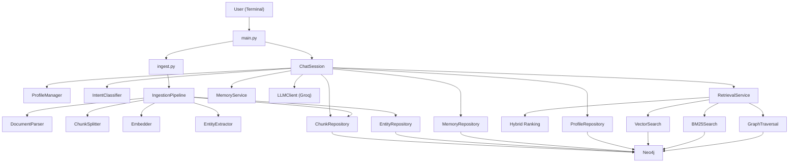
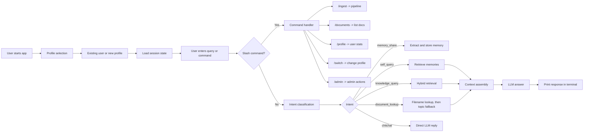
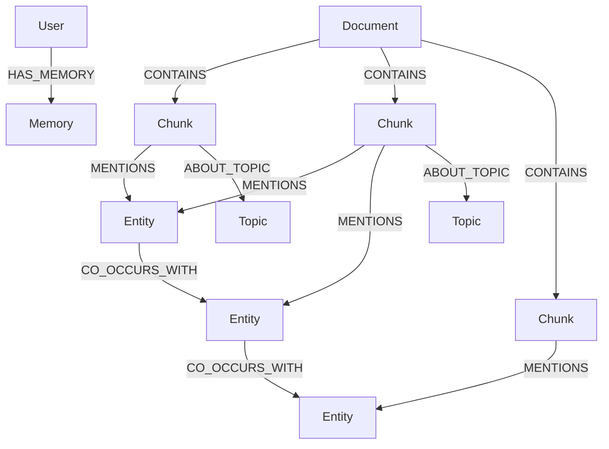

# Memory-Assistant: Knowledge Graph RAG

[](https://opensource.org/licenses/MIT)
[](https://www.python.org/downloads/)
[](https://neo4j.com/)
[](https://groq.com/)

Memory-Assistant is a Neo4j-based Knowledge Graph RAG system that combines document ingestion, hybrid retrieval, personal memory, and multi-user profile isolation. The active application lives in `knowledge-graph-rag/`.

## What It Does

- Ingests PDF and text documents into a Neo4j-backed knowledge graph
- Stores personal memories separately from document knowledge
- Supports multiple user profiles with isolated private namespaces
- Uses hybrid retrieval with vector search plus BM25
- Supports document lookup, profile switching, and admin utilities

## Main Features

- Hybrid retrieval over vector search and BM25
- Document graph with `Document`, `Chunk`, `Entity`, and `Topic` nodes
- Personal memory storage and self-query support
- Multi-user profile isolation with per-user `user_id` stamping
- Terminal commands like `/ingest`, `/documents`, `/profile`, `/switch`, and `/admin users`
- Docker-based local setup with Neo4j

## Repository Layout

```text
Memory-Assistant/
|-- README.md
`-- knowledge-graph-rag/
    |-- docker-compose.yml
    |-- Dockerfile
    |-- ingest.py
    |-- main.py
    |-- requirements.txt
    `-- src/
        |-- chat/
        |-- graph/
        |-- ingestion/
        |-- llm/
        |-- memory/
        `-- retrieval/
```

## Architecture Diagram



## System Workflow Diagram



## Knowledge Graph Working Diagram



## How Knowledge Is Stored

- Personal memory:
  `(:User)-[:HAS_MEMORY]->(:Memory)`
- Ingested document knowledge:
  `(:Document)-[:CONTAINS]->(:Chunk)`
- Chunk enrichment:
  `(:Chunk)-[:MENTIONS]->(:Entity)` and `(:Chunk)-[:ABOUT_TOPIC]->(:Topic)`
- Cross-entity connections:
  `(:Entity)-[:CO_OCCURS_WITH]->(:Entity)`
- Multi-user isolation:
  `Chunk`, `Document`, and `Memory` nodes are stamped with `user_id`

## Retrieval Flow

1. User sends a query in the terminal.
2. The system classifies the intent.
3. For knowledge queries, it runs vector search plus BM25.
4. Results are merged, deduplicated, and ranked.
5. Context is assembled from the top chunks.
6. The LLM answers strictly from retrieved context.

## Setup

From the repository root:

```powershell
cd .\knowledge-graph-rag
docker compose build app
docker compose up -d neo4j
```

Set your Groq API key in PowerShell:

```powershell
$env:GROQ_API_KEY="your_actual_key"
```

Run the chat application:

```powershell
docker compose run --rm app python main.py
```

Run standalone ingestion:

```powershell
docker compose run --rm app python ingest.py /app/data
```

## Common Commands

```text
/ingest <path>
/documents
/profile
/switch
/memories
/forget <text>
/stats
/debug <query>
/admin help
/admin users
/admin ingest <username> <path>
/quit
```

## Example Questions

- `Tell me about knowledge graphs`
- `Tell me about nontowered airports`
- `Tell me about Chapter 10 from The Fintech Book PDF.pdf`
- `What do you know about me?`
- `What papers do you have?`

## Notes

- Local cache, session data, and dataset folders are excluded from Git.
- Docker build context is trimmed with `.dockerignore`.
- The Mermaid diagrams above are written in GitHub-compatible syntax.
