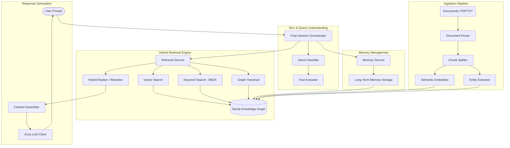

# 🧠 Memory-Assistant: Knowledge Graph RAG (KG-RAG)

[](https://opensource.org/licenses/MIT)
[](https://www.python.org/downloads/)
[](https://neo4j.com/)
[](https://groq.com/)

**The Memory-Assistant** is an enterprise-grade, high-performance Knowledge Graph Retrieval-Augmented Generation (KG-RAG) system. It combines the structured reasoning of graph databases with the semantic power of vector search to provide high-fidelity, context-aware AI interactions. 

Unlike traditional RAG systems that rely solely on vector proximity, Memory-Assistant builds a dynamic knowledge network, extracting entities and relationships to ensure deep context and long-term memory across sessions.

---

## 🏛️ System Architecture

The core of Memory-Assistant is a hybrid retrieval engine orchestrated by a specialized memory layer, all centered around a Neo4j Knowledge Graph.



---

## 🚀 Key Features

- **🛡️ Industrial-Grade Knowledge Graph**: Utilizes Neo4j for high-performance relationship mapping and complex graph traversals.
- **🔄 Triple-Hybrid Retrieval**:
  - **Vector Search**: Semantic similarity using `all-MiniLM-L6-v2`.
  - **BM25**: Full-text keyword search for precise term matching.
  - **Graph Traversal**: Discovering high-order relationships between entities (2nd/3rd degree links).
- **🧠 Persistent Long-Term Memory**: Automatically extracts and stores key facts from user conversations into the graph, allowing the AI to "remember" personal preferences and past context.
- **⚡ Ultra-Low Latency**: Powered by Groq's LPU™ Inference Engine for blazing-fast token generation.
- **🏗️ Structured Entity Extraction**: Automatically builds an ontology of entities and their relationships during document ingestion.
- **🐳 Dockerized Infrastructure**: One-click deployment for Neo4j and the processing environment.

---

## 🛠️ Tech Stack

| Component | Technology |
| :--- | :--- |
| **LLM Engine** | Groq (Llama-3.1-70B/8B) |
| **Graph DB** | Neo4j |
| **Embeddings** | HuggingFace (Sentence-Transformers) |
| **Orchestration** | Python 3.10+ / Asyncio |
| **Validations** | Pydantic v2 |
| **Logging** | Loguru |
| **Containerization**| Docker / Docker Compose |

---

## 🚦 Getting Started

### 1. Prerequisites
- [Docker](https://www.docker.com/) & [Docker Compose](https://docs.docker.com/compose/)
- [Groq API Key](https://console.groq.com/)

### 2. Configuration
Create a `.env` file from the example:
```bash
cp .env.example .env
```
Fill in your `GROQ_API_KEY` and adjust settings as needed:
```env
NEO4J_URI=bolt://neo4j:7687
NEO4J_USER=neo4j
NEO4J_PASSWORD=password123
GROQ_API_KEY=your_key_here
```

### 3. Launch with Docker
```bash
docker-compose up --build
```
This will spin up the Neo4j instance and the Memory Assistant container.

---

## 📖 Usage Guide

### STANDALONE INGESTION
To ingest documents before chatting:
```bash
docker-compose exec app python ingest.py /app/data/my_document.pdf
```
You can also ingest an entire directory:
```bash
docker-compose exec app python ingest.py /app/data/
```

### INTERACTIVE CHAT
The main entry point starts the interactive terminal session:
```bash
docker-compose exec app python main.py
```
> [!TIP]
> Use command-line arguments to customize your session. The system will automatically load the last session ID for persistent memory.

---

## 🧩 System Design & Workflow

### 1. The Ingestion Pipeline
Documents are processed through a strictly defined pipeline:
1.  **Parsing**: Documents are converted to clean text.
2.  **Splitting**: Text is split into overlapping chunks (default: 512 tokens).
3.  **Embedding**: Each chunk is transformed into a dense vector (384 dimensions).
4.  **Extraction**: Entities (People, Places, Concepts) are extracted and linked to chunks.
5.  **Graph Mapping**: Data is persisted in Neo4j with a schema that connects `Doc -> Chunk -> Entity`.

### 2. The Retrieval Workflow
When a query is received:
1.  **Intent Classification**: LLM analyzes if the user is asking about data, facts, or general chat.
2.  **Multi-Query Generation**: The system generates variations of the query for better coverage.
3.  **Hybrid Search**:
    - **Vector search** finds semantically relevant chunks.
    - **BM25 search** finds exact keyword matches.
    - **Graph search** finds connected nodes within the graph.
4.  **Reranking**: Results are deduplicated and ranked based on relevance scores.
5.  **Generation**: LLM processes the curated context to generate a precise answer.

### 3. Memory Persistence
Unlike "Stateless" RAG, this system uses a `MemoryService`:
- It extracts **Facts** from every user interaction.
- These facts are stored as **Memory Nodes** in the graph.
- During retrieval, the `ContextAssembler` injects relevant past facts (Long-Term Memory) into the prompt, enabling seamless context-aware conversations over days or months.

---

## 🧬 Project Structure

```text
knowledge-graph-rag/
├── src/
│   ├── chat/              # Terminal Session & UI Logic
│   ├── graph/             # Neo4j Repositories & Client
│   ├── ingestion/         # Document Processing Pipeline
│   ├── llm/               # Groq Client & Context Assembly
│   ├── memory/            # Long-term Memory Management
│   └── retrieval/         # Hybrid Search & Reranking
├── data/                  # Ingestion Data Source
├── session_data/          # Local Session State
├── main.py                # Chat Entry Point
├── ingest.py              # Ingestion CLI Utility
└── docker-compose.yml     # Infrastructure Config
```

---

## 🛡️ License
Distributed under the MIT License. See `LICENSE` for more information.

---

<p align="center">
  <b>Developed for Industrial Performance by Antigravity</b><br>
  Built with ❤️ using Knowledge Graph Technology
</p>
